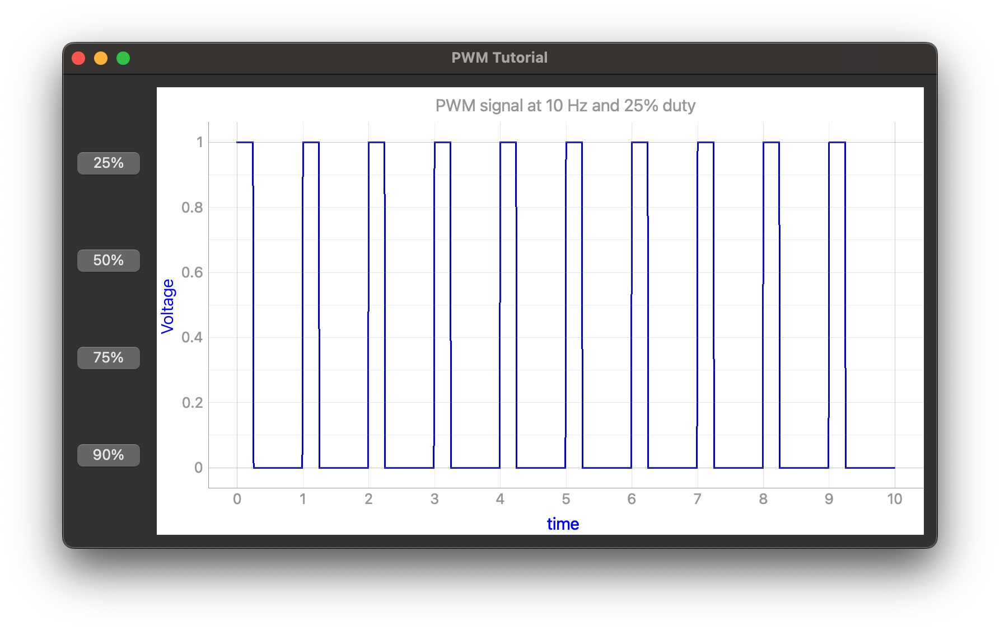

# PWM-tutorial

Create a pulse width modulation signal in python, graph it, and see the effect of modifying the duty cycle. 

GUI is PyQt6 and graph is generated using pyqtgraph. matplotlib is not used.

## Installation
```
$ git clone git@github.com:gmarzloff/PWM-tutorial.git
$ cd PWM-tutorial && pip install -r requirements.txt
$ python main.py
```

## Use
Control the graph by pressing the duty cycle buttons on the left.

